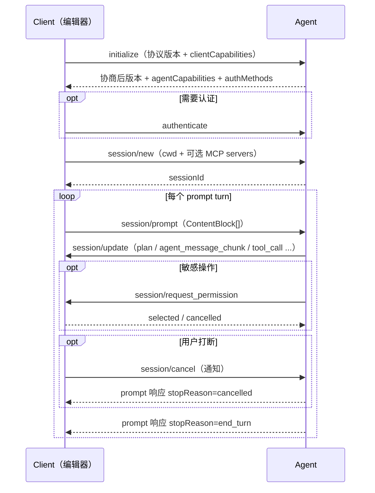

# ACP 与编辑器协议：Client 与 Agent 的标准握手

> ACP（Agent Client Protocol）解决的是「编辑器如何驱动编程 Agent」的标准化——就像 LSP 之于语言工具：Agent 实现一次，任何 ACP 编辑器都能用；编辑器实现一次，整个 ACP Agent 生态即插即用。
>
> **边界：** 本篇管 client↔agent 会话协议。Agent 调工具见 [31 MCP](./31-mcp-and-agent-protocols.md)，agent↔agent 协作是 A2A（不在本仓库范围）。
>
> **配套实验：** [05 ACP Agent](./examples.md#05-acp-agent) — 官方 SDK 实现最小 agent：版本协商、流式 prompt turn、权限请求、取消；内存流对测试，stdio 可被 Zed 直接挂载，`--ollama` 接本地 gemma4。

## 先排雷：三个「ACP」只有一个活着

| 全称 | 方向 | 现状 |
|------|------|------|
| **Agent Client Protocol**（Zed / JetBrains） | client ↔ agent | **活跃，本篇主角** |
| Agent Communication Protocol（IBM/BeeAI） | agent ↔ agent | 2025-08 并入 A2A，仓库归档 |
| Agent Connect Protocol（AGNTCY） | agent ↔ agent | 2026-04 归档 |

读旧文章时注意：2025 年中的「ACP」多指 IBM 那个；现在说 ACP 默认是 Zed 的。

## 协议版图：ACP 补的是哪块

| 协议 | 连接 | 类比 |
|------|------|------|
| MCP | agent ↔ 工具/数据 | USB 接口 |
| **ACP** | **client（编辑器/CLI）↔ agent** | **LSP** |
| A2A | agent ↔ agent | 微服务间 RPC |

三者组合不冲突：编辑器通过 ACP 驱动 agent；agent 自己是 MCP client，`session/new` 时 client 可把 MCP server 列表一并交给 agent。

## 通信模型

- JSON-RPC 2.0；本地 agent 是编辑器子进程，走 **stdio ndjson**；远程 agent（HTTP/WebSocket）仍是 WIP。
- 方法是有响应的请求，通知是单向消息；`_meta` 字段和 `_` 前缀方法做扩展。
- 用户可读文本默认 Markdown；文件路径必须绝对路径，行号 1-based。

## 生命周期

三个容易做错的点：

1. **版本协商是强制的**：client 报自己支持的最新主版本；agent 支持则回同样版本，否则回自己最新的；client 不接受就断连。实验 05 用 `Math.min` 演示回退。
2. **取消不能是报错**：`session/cancel` 后 agent 必须停掉模型请求和工具调用，prompt 响应 `stopReason: "cancelled"`——把 abort 异常原样抛成 JSON-RPC error 是实现错误。
3. **能力省略即不支持**：initialize 里没声明的能力一律视为不支持，新增能力不算 breaking change。

## session/update 的 11 种变体

流式体验全靠这个通知。`params.update.sessionUpdate` 区分：

| 变体 | 用途 |
|------|------|
| `agent_message_chunk` / `agent_thought_chunk` / `user_message_chunk` | 流式正文 / 思考过程 / 回显用户消息（同 messageId 属同一条） |
| `tool_call` / `tool_call_update` | 新工具调用 / 状态推进（pending→in_progress→completed/failed） |
| `plan` | 执行计划条目（content/priority/status） |
| `available_commands_update` | 斜杠命令集变化 |
| `current_mode_update` / `config_option_update` | 会话模式 / 配置项变化 |
| `session_info_update` | 标题等元数据 |
| `usage_update` | context 用量与累计成本（used/size token 数，cost 可选） |

## 能力协商要点

- **clientCapabilities**：`fs.readTextFile/writeTextFile`（agent 经 client 读写文件，权限留在编辑器侧）、`terminal`（agent 经 client 跑命令）、`elicitation`（结构化向用户提问）。
- **agentCapabilities**：`loadSession`（会话恢复）、`promptCapabilities`（image/audio/embeddedContext，文本和 resource_link 是基线必有）、`mcpCapabilities`（agent 能连 http/sse 的 MCP server）。

## 设计原则

- 会话状态归 agent，展示与权限归 client——编辑器永远掌握文件写法和命令执行的最终批准权。
- 敏感操作必须走 `session/request_permission`，给出 `allow_once/reject_once` 等明确选项。
- 流式优先：先回 chunk 再慢慢完善，不等完整答案。
- 复用 MCP 的 JSON 表示（ContentBlock 等），减少双向翻译。

## 验收标准

- initialize 完成版本与能力协商，版本不匹配能回退或断连。
- prompt turn 全程流式，stopReason 语义正确（end_turn/max_tokens/max_turn_requests/refusal/cancelled）。
- 敏感操作未经权限确认不执行。
- cancel 后模型请求与工具调用真正中断，且不以报错形式呈现。
- 以上四条在实验 05 均有可运行测试（9 条用例，内存流对，不起进程）。

## 生态与落地

- 编辑器：Zed 原生，JetBrains 共建，VS Code 有插件。
- Agent：Claude Code、Gemini CLI、Codex CLI 等均已支持；Gemini CLI 的 agent 侧实现是官方推荐的完整参考。
- SDK：`@agentclientprotocol/sdk`（TS，v1.5.x 稳定；v2 是 draft，import 路径带 `/experimental/v2` 才启用）。

## 实践任务

1. 实现最小 agent：initialize/new/prompt/cancel 四个基线方法（05 已完成）。
2. 为敏感操作接 request_permission，验证 allow/reject 两条路径（05 已完成）。
3. 把 agent 挂到 Zed，对比自研 client 与真实编辑器的消息流。
4. 思考：你的 agent 哪些能力该声明？`loadSession` 需要什么持久化？

## 与已有内容的关系

- MCP 与整体协议版图见 [31](./31-mcp-and-agent-protocols.md)。
- Agent 侧的超时、审批、熔断护栏见 [30](./30-agent-reliability-and-security.md)——ACP 的权限请求是其中「审批」在协议层的标准形态。
- 取消与中断的工程实现见 [08](./08-build-first-agent.md) 的 Agent 循环。
