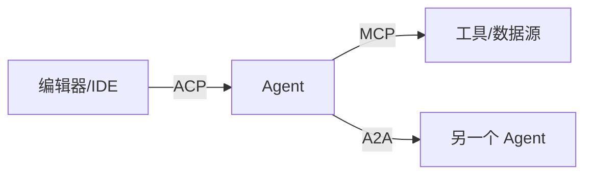
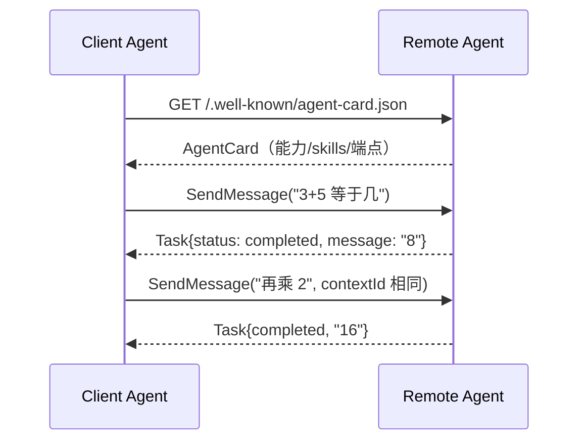

# A2A 与 Agent 互联：Agent 之间的标准语言

> A2A（Agent2Agent）解决的是「Agent 如何发现并委托另一个 Agent」的标准化——Google 2025-04 发布，2025-06 捐给 Linux Foundation，2026 年初到 **v1.0**（150+ 组织背书）。传输就是 JSON-RPC 2.0 over HTTP（另有 gRPC、HTTP+JSON 绑定），没有私有协议。
>
> **边界：** 本篇管 agent↔agent 协作协议。Agent 调工具见 [31 MCP](./31-mcp-and-agent-protocols.md)，编辑器驱动 agent 见 [32 ACP](./32-acp-agent-client-protocol.md)。
>
> **配套实验：** [08 A2A Agent](./examples.md#08-a2a-agent) — 官方 `@a2a-js/sdk` 实现最小计算器 agent：AgentCard、SendMessage/GetTask/CancelTask、任务生命周期，内存传输可测。

---

## 协议版图补全

| 协议 | 连接 | 类比 | 状态（2026-09） |
| --- | --- | --- | --- |
| MCP | agent ↔ tool | USB-C 接口 | 事实标准 |
| ACP | client ↔ agent | LSP | Zed/JetBrains 在用 |
| A2A | agent ↔ agent | HTTP 之于服务 | v1.0，Linux Foundation |

## 核心概念

| 概念 | 说明 |
| --- | --- |
| **AgentCard** | agent 的「名片」JSON，发布在 `/.well-known/agent-card.json`（RFC 8615）；v1.0 可用 JWS（RFC 7515）签名防伪 |
| **Task** | 委托工作的单位，有状态机：submitted → working → completed/failed/canceled/input-required/rejected |
| **Message** | 一轮对话内容，`role: user/agent` + `parts[]` |
| **Part** | 内容块 oneof：text / file(raw/url) / data |
| **Artifact** | 任务的产出物（文件、结构化数据），挂在 Task 上 |
| **contextId** | 多轮会话的关联键：同一 contextId 的消息属于同一对话 |

## 方法全集（v1.0）

| 方法 | 语义 |
| --- | --- |
| `SendMessage` | 发消息（unary），返回 Task 或 Message |
| `SendStreamingMessage` | 发消息（SSE 流），持续收 status/artifact 更新 |
| `GetTask` / `ListTasks` | 查任务 |
| `CancelTask` | 取消运行中任务 |
| `SubscribeToTask` | 重连后续订任务事件流 |
| `GetExtendedAgentCard` | 认证后取更详细的名片 |

> v0.x 的 `message/send`、`tasks/get` 在 v1.0 统一为 proto 规范名（`SendMessage`、`GetTask`）。

## v1.0 相对 0.x 的 breaking changes

- `url` / `protocolVersion` 从 AgentCard 顶层移入 `supportedInterfaces[]` 每项
- `preferredTransport` / `additionalInterfaces` 合并进 `supportedInterfaces[]`
- `supportsAuthenticatedExtendedCard` 移到 `capabilities.extendedAgentCard`
- 全字段 camelCase；错误用 `google.rpc.Status` 结构化
- `a2a.proto` 成为唯一权威定义，各语言 SDK 从 proto 生成

常见 JSON-RPC 错误码：`-32001` TaskNotFound、`-32002` TaskNotCancelable（终态任务不可取消）。

## 最小交互序列

## 实测踩坑（08 实验）

| 坑 | 现象 | 解法 |
| --- | --- | --- |
| ts-proto 内部形态 | executor 里传字符串枚举得到 `UNRECOGNIZED` | 用 `TaskState.TASK_STATE_COMPLETED` 数字枚举；Part 是 `{ content: { $case: "text", value } }` |
| proto3 optional 类型 | `.d.ts` 里 `tenant: string` 无 `\| undefined`，但运行时可缺省 | `undefined!` 显式标记 |
| 请求枚举名 | `role: "user"` 不识别 | JSON 层用 proto 名 `"ROLE_USER"` |
| 响应 oneof | 直接取 `result.status` 是 undefined | 响应是 `{ task } / { message }` 包装，先解包 |
| `server/database` 子路径 | 顶层 import 拉进可选 peer `kysely` | `InMemoryTaskStore` 从 `@a2a-js/sdk/server` 直接导出 |

## 选型建议

- **多 agent 系统互联**（跨团队/跨厂商）：A2A 是目前唯一有治理机构背书的开放标准
- **单一产品内部**：不需要 A2A——直接函数调用或消息队列更简单
- **与 MCP 的关系**：互补不竞争。MCP 给 agent 接工具，A2A 让 agent 把子任务委托给别的 agent

---

## 小结

- A2A v1.0 = AgentCard 发现 + Task 状态机 + JSON-RPC/gRPC/REST 三绑定
- 协议版图补全：MCP（工具）、ACP（编辑器）、A2A（agent 互联）
- 08 实验验证了最小闭环：名片 → 发消息 → 任务完成 → 多轮 → 错误语义
