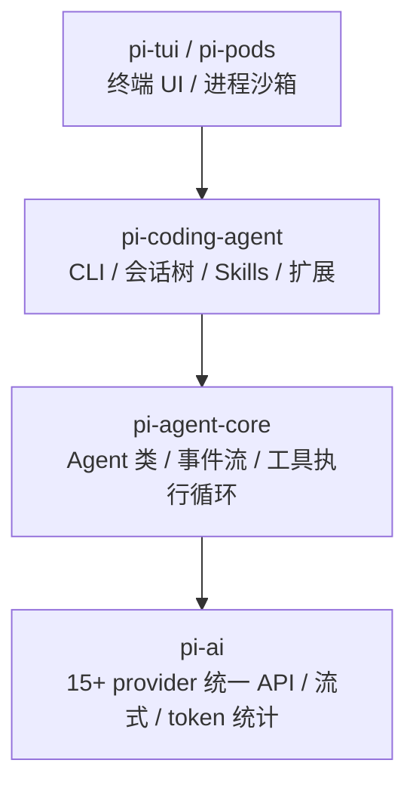
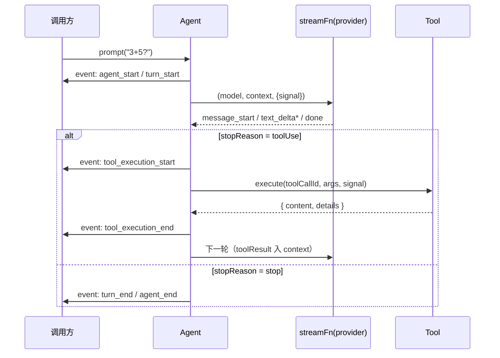

# 01 架构拆解：四层 monorepo 与事件驱动循环

> Pi 的 monorepo（[badlogic/pi-mono](https://github.com/badlogic/pi-mono)）分四层，每层都可独立使用。理解分层的意义：你可以只取其中一层——比如只用 pi-ai 做统一 LLM 调用，或只用 pi-agent-core 做自己的 agent 循环——而不必吞下整个 coding agent。

---

## 四层架构



| 层 | 包 | 职责 | 类比 |
| --- | --- | --- | --- |
| 基础层 | `pi-tui` / `pi-pods` | 终端交互组件、进程隔离 | xterm.js + docker-lite |
| 模型层 | `pi-ai` | 统一 15+ provider（OpenAI/Anthropic/Gemini/Ollama 兼容端点…）的流式调用、tool calling、token/cost 追踪 | 轻量版 Vercel AI SDK |
| 循环层 | `pi-agent-core` | `Agent` 类：prompt → 流式响应 → 工具执行 → 结果回传的多轮循环，事件总线，steering/followUp 队列，abort | LangGraph 的极简对立面 |
| 应用层 | `pi-coding-agent` | CLI、JSONL 会话树（可分支回溯）、Skills、扩展系统、4 个核心工具 | Claude Code 本体 |

关键设计：**下层对上层零感知**。pi-ai 不知道 agent 存在，pi-agent-core 不知道 CLI 存在。

## pi-agent-core：事件驱动的 agent 循环

`Agent` 是整个架构的心脏，但源码只有千行量级。它的全部工作：



### 事件全集

| 事件 | 时机 | 携带 |
| --- | --- | --- |
| `agent_start` / `agent_end` | 一次 prompt 的整体边界 | — |
| `turn_start` / `turn_end` | 单轮「模型响应+工具执行」边界 | — |
| `message_start` / `message_end` | 一条 assistant 消息 | message |
| `message_update` | 流式增量 | `assistantMessageEvent`（`text_delta` 等） |
| `tool_execution_start` / `tool_execution_end` | 工具调用边界 | toolName / 结果 |

UI 层（pi-coding-agent 的 TUI）完全由这些事件驱动——**事件流就是渲染层的唯一数据源**，这让「同一个 agent 内核换 UI」成为 trivial 的事。

### 三个实例钩子（可替换的行为点）

| 钩子 | 默认行为 | 用途 |
| --- | --- | --- |
| `streamFn` | 按 model.api 分发到 provider 实现 | **mock 测试**（注入剧本式假流，CI 不依赖真实模型） |
| `getApiKey` | 查 provider 的 envMap | 接自定义 provider（如 Ollama 无 key 概念，返回占位值） |
| `onPayload` / `onResponse` | 透传 | 观测/记录原始请求响应 |
| `beforeToolCall` / `afterToolCall` | 透传 | 权限拦截、结果改写 |

### steering 与 followUp

`agent.steer(msg)` 在当前 turn 结束后立即插入消息（打断既定计划），`agent.followUp(msg)` 排到队尾。这是「人在回路」的协议层实现——CLI 里按 Esc 输入新指令走的就是 steer。

### abort 契约

`agent.abort()` 把 `AbortSignal` 传给 `streamFn`。**流必须自己监听 signal 并推 `error` 事件收尾**，Agent 不会替你掐断流——真实 provider 的实现如此，mock 也要遵守，否则 `prompt()` 的 Promise 永不 settle（我们在 06 实验里踩过这个坑）。

## pi-ai：模型抽象的最小集

一个 `Model` 对象就是全部配置：

```ts
const model: Model<"openai-completions"> = {
  id: "gemma4:latest",
  api: "openai-completions",   // 决定用哪套 provider 实现
  provider: "ollama",
  baseUrl: "http://localhost:11434/v1",
  reasoning: false,
  input: ["text"],
  cost: { input: 0, output: 0, cacheRead: 0, cacheWrite: 0 },
  contextWindow: 8192,
  maxTokens: 2048,
};
```

`api` 字段是分发键：`openai-completions`（OpenAI 兼容端点，Ollama/vLLM/LM Studio 都走它）、`anthropic-messages`、`google-generative-ai` 等。新增 provider = 提供一个 baseUrl + 手搓 Model 对象，**不需要注册表**。

## 与 LangGraph 的对照

| 维度 | Pi (pi-agent-core) | LangGraph |
| --- | --- | --- |
| 控制流 | 固定 loop + 事件 | 显式图（节点/边/条件） |
| 状态 | `agent.state.messages` 数组 | 自定义 StateGraph schema |
| 扩展点 | 实例钩子 + 事件订阅 | 节点组合 |
| 适合 | coding agent 这类「工具循环」形态 | 多分支、多人协作的复杂流程 |

Pi 的取舍很鲜明：**coding agent 的 loop 形态高度收敛**（prompt→tool→prompt），不需要图引擎的通用性，换来的是千行内核和零学习成本。

---

## 小结

- 四层架构，下层零依赖上层；可只取一层用
- `Agent` = 固定工具循环 + 事件总线 + 三个实例钩子；事件流驱动 UI
- abort 契约：streamFn 必须自己响应 signal
- pi-ai 的 `Model` 是普通对象，`api` 字段分发 provider 实现

下一篇：[02 可扩展性：为什么核心只有 4 个工具](./02-extensibility.md)。
