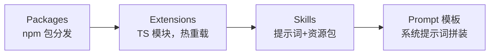

# 02 可扩展性：为什么核心只有 4 个工具

> pi-coding-agent 开箱只有 `read` / `write` / `edit` / `bash` 四个工具——连「列目录」「搜文件」都没有。这不是偷懒，是刻意的哲学：**核心保持极简，一切领域能力用代码在运行时注入**。本篇拆解它的四层扩展机制。

---

## 扩展机制的四个层次



| 层次 | 形态 | 改什么 | 例子 |
| --- | --- | --- | --- |
| Prompt 模板 | Markdown 片段 | 系统提示词 | 「回复一律用中文」 |
| Skills | 目录（SKILL.md + 脚本/资源） | 给模型「知识+操作手册」 | 「按本仓库规范写 commit」 |
| Extensions | TypeScript 模块 | 加工具、钩子、命令、UI 组件 | 加 `git_status` 工具 |
| Packages | npm 包 | 分发上面三者的组合 | 团队内部扩展包 |

关键区分：**Skills 是给模型看的**（提示词+上下文资源），**Extensions 是给 agent 内核用的**（真实代码，注册新工具/钩子）。Claude Code 的 Skills 概念与 Pi 的 Skills 同源，但 Pi 的 Extensions 走得更远——可以往 TUI 里注入自定义组件。

## Extensions：代码即配置

一个扩展就是导出一个工厂函数的 TS 模块：

```ts
// ~/.pi/agent/extensions/git-status.ts
import type { ExtensionFactory } from "@mariozechner/pi-coding-agent";

export default function gitStatusExtension(pi) {
  pi.registerTool({
    name: "git_status",
    label: "Git Status",
    description: "查看当前仓库状态",
    parameters: Type.Object({}),
    execute: async () => {
      const { stdout } = await pi.exec("git", ["status", "--short"]);
      return { content: [{ type: "text", text: stdout }], details: {} };
    },
  });

  pi.on("session_start", async () => {
    pi.ui.notify("git-status 扩展已加载");
  });
}
```

与「JSON 声明式配置」相比，代码扩展的代价是门槛，收益是：

- **可测试**：扩展是普通模块，vitest 直接单测
- **热重载**：保存即生效，不重启会话
- **全表达能力**：条件逻辑、循环、调任意 npm 包——配置文件的 DSL 永远追不上

## Skills：模型的操作手册

Skill 是一个目录，至少含 `SKILL.md`（frontmatter 描述 + 正文指令），可附带脚本、模板、参考文档。agent 在匹配到任务时把 SKILL.md 注入上下文。与工具的区别：

| | Skill | Tool |
| --- | --- | --- |
| 消费者 | 模型（读了照做） | agent 内核（直接执行） |
| 确定性 | 低（靠模型遵守） | 高（代码） |
| 适合 | 流程规范、领域知识 | 原子操作 |

经验法则：**能用工具固化的不要写成 Skill**——工具是强约束，Skill 是软提示。

## 会话树：JSONL 里的 git

pi-coding-agent 把会话存成 JSONL，每条消息带父指针，形成**树**而非线性日志。收益：

- 从任意历史节点分叉重试（类似 git branch）
- 会话可 diff、可回放、可进版本控制
- `/tree` 命令可视化跳转

这是「会话即数据」的设计——不锁在二进制数据库里，纯文本、行式追加、崩溃安全。

## 与 Claude Code / OpenClaw 的关系

Pi 是 OpenClaw 的底层内核；Claude Code 与 Pi 在「Skills + 扩展 + 会话」的概念上高度相似（互相借鉴）。选型建议：

- 要**开箱即用的商业产品** → Claude Code
- 要**白盒、可嵌入自己应用的内核** → Pi（下一篇的 SDK 嵌入）
- 要**多 agent 编排** → 看本仓库的 LangGraph 系列

---

## 小结

- 核心 4 工具是刻意的：领域能力走 Skills（软提示）或 Extensions（硬代码）
- Extensions = 普通 TS 模块，可测试、热重载、npm 分发
- 会话是 JSONL 树，可分叉可回放
- 取舍：用「代码门槛」换「全表达能力」

下一篇：[03 SDK 嵌入：createAgentSession 与自定义 provider](./03-sdk-embedding.md)。
